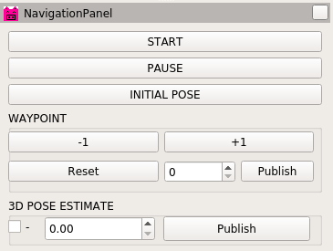

# kcctplugin
自律移動用のrviz plugin

 
---
## Dependency

* 必要パッケージは[rosenv](https://github.com/hrjp/rosenv/blob/main/package_install.bash)
* docker imageを利用する場合[naviton](https://github.com/KobeKosenRobotics/naviton)

```bash
git clone https://github.com/hrjp/rosenv
./rosenv/package_install.bash
```
---
## Kobe Kosen Robotics Navigation Packages
* [naviton](https://github.com/KobeKosenRobotics/naviton)
    * kobe kosen roboticsの自律移動ロボットnavitonの環境構築
* [kcctcore](https://github.com/hrjp/kcctcore)
    * 各パッケージをつなぐマスターパッケージ
* [kcctnavigation](https://github.com/hrjp/kcctnavigation)
    * 自律移動用アルゴリズム全般
* [waypoint_tools](https://github.com/hrjp/waypoint_tools)
    * waypointの読み書きなどwaypointに関連するノード全般
* [kcctsim](https://github.com/hrjp/kcctsim)
    * gazebo simulationとrobotのURDFモデル
* [kcctplugin](https://github.com/hrjp/kcctplugin)
    * 自律移動用のrviz plugin
* [kcctfirm](https://github.com/hrjp/kcctfirm)
    * 自律移動ロボットNavitonのファームウェア
* [LeGO-LOAM](https://github.com/hrjp/LeGO-LOAM)
    * 3D Mapping
    * forked from [LeGO-LOAM](https://github.com/RobustFieldAutonomyLab/LeGO-LOAM)


---
## Reference

* [オリジナル Rviz Plugin をつくってみよう](https://qiita.com/RyodoTanaka/items/eadfb81bd52404dabdb4)
